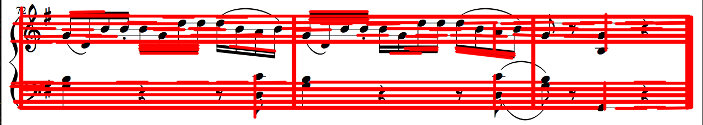
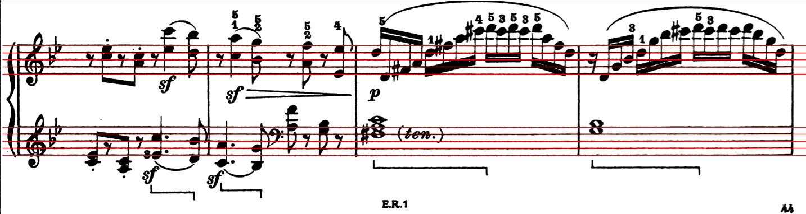

# Assignment 1 - nchaddder, yashjain, grifhall

# Introduction

The goal of the assignment is to implement several basic image operations such as image resampling, convolution, and edge detection. Using these operations to detect musical symbols in the image i.e. create an Optical Music Recognition (OMR) program. The OMR system should be capable to detect where the note head, quarter rest and eighth rest are in the image.

## Creating convolution kernels

We implement two different functions to create convolution kernels. One function creates a MxM mean filter, while the other creates separable kernels Hx, Hy of the given size.

## Convolutions

We implement two different types of convolution functions. One function uses a 2 dimensional convolution filter and the other function uses two separable filters Hx and Hy. The convolution operations are created to handle both odd and even length kernels. The 2-d convolution function is implemented to handle kernels that may have different lengths of rows and columns i.e. they need not be MxM filters and can be MxN filters. 

## Template Matching Method 1

The goal of step 5 in the assignment is to locate various musical symbols in the image. To solve this problem, we have implemented `detect_template_method_1` function that accepts input image and templates as an input parameter. The function will then load the input image and templates and convert them to grayscale image. The function then goes on to convert grayscale image and templates into binary and inverse of the binary images. We then apply 2D convolution in the images using the for loops with the given template. The images then has to be normalized after applying convolution. 

We then calculate the distance between the two images and if the value is above certain threshold, the musical symbol present in that specific template was found. It is possible that there might be more than one value above certain threshold and so non maximum suppression was used to keep only one value. 

## Edge Detection

For edge detection, we first create a function that creates **sobel operators** Sx, Sy. These sobel operators are used to implement edge detection. We also convert the image (after edge detection) to an edge map with values 0 or 1. 

**Notes:**

* While the edge detector works well on simpler images, its performance reduces with more complex images.
* Using canny edge detector would improve the performance of the edge detection. We checked this by using opencv's implementation of canny edge detection, and we generated much better results. 
* One major issue while implementing this was that we were getting very noisy images after edge detection. The images contained black lines as artifacts all over the image. After trying various ways to check my implementations of the edge detection, calculation of euclidean distance, and convolution operations, while also trying smoothing, I realized the issue was much simpler *(read: stupider)*. I was updating the values in the same image I was reading from, instead of making a copy of the image. 

## Template Matching Method 2

For the method 2, we first create edge maps of the image and all three templates. Then we calculate D(i, j) for the given image. Then, using this D(i, j), we convolve it with all three templates to create 3 different matrices F(i, j) for three different templates. Then, we use this to find all points of interest in the given image and draw bounding boxes for all points of interest. We also write the values to a text file, as per given instructions. 

**Notes:**

* Calculation of D(i, j) turns out to be the main bottleneck in our implementation of the OMR. It has a time complexity of O(n^4). Current implementation takes forever to calculate the function and we could not get the final value of it since the running time seems to take forever. This remains a major area of improvement for the implementation. The running time could be improved by matrix vectorization using numpy and/or by converting it into a separable kernel problem. But, we could not figure out the way to implement those improvements.
* Since we could not calculate D(i, j), we could not test the functionality of drawing bounding boxes around note heads and writing proper values to text file. While we did test the working of these functionalities using a dummy/mock D(i, j) matrix, it is by no means an indicaction whether the outputs would be correct with actual values of D(i, j). Testing this properly remains an area of improvement.
* Nevertheless, we believe our current implementation would lead to multiple bounding boxes for the same note heads. This can be improved either by skipping the values of i, j after a box is drawn, or by taking average of multipe values and then drawinf a single box for them.
* Similarly, we were unable to test whether the pitch written in the text file is correct. We calculate it by creating a dictionary of pitches and the height of staff lines in the image. Then we check the closest match in height of the detected note and the heights in the dictionary, and then write the closest match into the text file. This also remains an area where we could certainly improve and do proper testing.
* One other area of improvement can be the selection of the threshold value for identifying which pixels should be deemed as points of interest. Currently we take the max value in the F(i, j) and divide it by 2. Then we check values for all pixels and every value above this threshold is deemed as a point of interest. We can improve how we select this threshold by finding pattersn in F(i, j) for all templates. This is again not tested because we could not calculate D(i, j) in tractable time.

## Finding Staff Lines
To calculate the staff lines, our first implementationw was just a standard Hough transformationon the image to find the edges. This however, didn't work as a final line detector because there were many detected lines both vertically and horizontally. Below is an example of this detector on our lines.



Using this, we ran into some problems like the vertical lines and the lines stopping because a note is located there. An idea in the assignment was to apply a hough transformation on all five lines and try to find where each of them lay. To do this, I changed the accumulator to look at all the lines below it and see which ones mactch the same pixel value as it. This way, our hough transformation has two dimensions: row cordinate of the first line and spacing of lines under it. However, when implementing this we found that iterating over the accumulator to update the values was taking a lot of time when the task itself was not needed.

To fix this, we updated the method so that we could take into account the pixels in each row and give higher priority when more black pixels are located in it. Then, we make a threshold saying that chosen lines cannot be within 3 pixels of each other so that we avoid clumping. Then, we sort the chosen lines so that we can classify them in dictionaries with the other 4 lines that they are around. Below is an example of our lines being detected using this hybrid method:



Lastly, we find the distance between two lines in a grouping of five so we can tell how big our image should be to match our template. If the image is too big or too small, we will resize it so that it is the desired size to work with out detection templates. After this, our staff detection portion is finished.

To run our code, simply type:

```
python3 omr.py
```
or
```
./omr.py
```

To run the sample python code, just type:

```
cd python-sample
python ./sample.py
```

To run the sample C++ code, type
```
cd c++-sample
make
./sample
```

